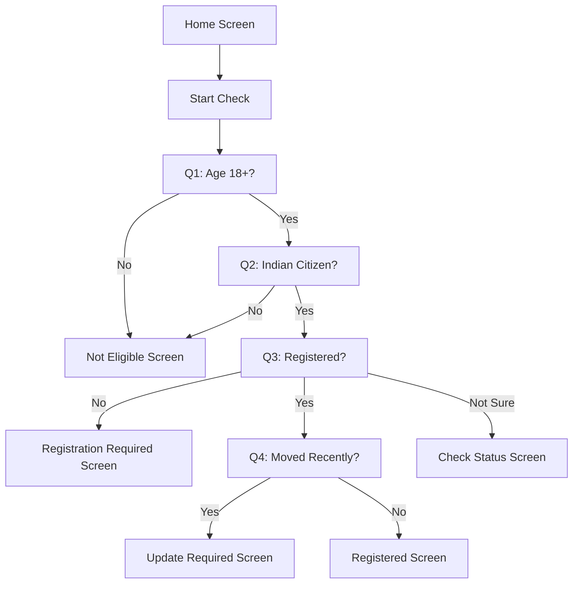
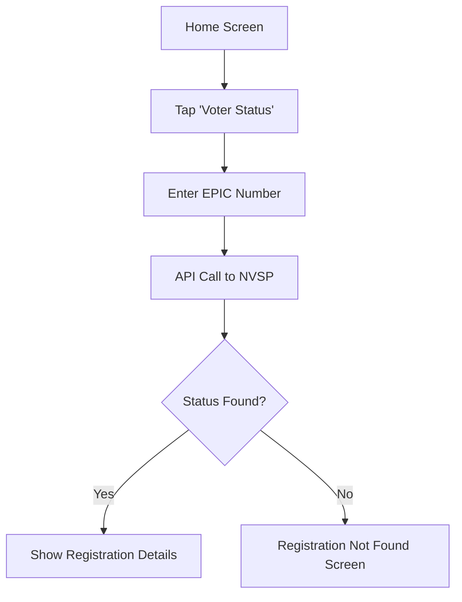
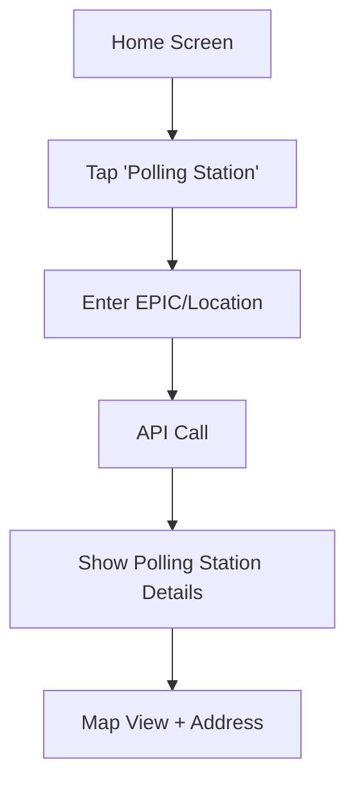

# MahaVote Clarity Design System

> **Official Maharashtra Election Assistant Design Documentation**  
> Version 1.0 | Last Updated: April 2026

---

## Table of Contents

- [Overview](#overview)
- [Design Principles](#design-principles)
- [Design Tokens](#design-tokens)
  - [Colors](#colors)
  - [Typography](#typography)
  - [Spacing](#spacing)
  - [Border Radius](#border-radius)
- [Component Library](#component-library)
- [Product Specifications](#product-specifications)
- [User Flows](#user-flows)
- [Screen Specifications](#screen-specifications)
- [Translation System](#translation-system)
- [Implementation Guidelines](#implementation-guidelines)

---

## Overview

### Project Goal

The **Maharashtra Election Assistant** is designed to answer one critical question in under 30 seconds:

> **"Can I vote in Maharashtra, and what should I do next?"**

### Target Audience

- First-time voters
- Citizens with limited digital literacy
- Users on low-end Android devices
- Voters in rural and urban Maharashtra
- Multi-lingual users (English, Marathi, Hindi)

### Design Philosophy: Institutional Minimalism

The design prioritizes **function over form**, utilizing:
- High-contrast elements for accessibility (WCAG AA compliance)
- Generous touch targets (48px minimum)
- Clean structural lines without heavy GPU processing
- Optimized for low-end devices and varied lighting conditions

---

## Design Principles

### 1. **Maximum Accessibility**
- WCAG AA contrast ratios (minimum 4.5:1 for body text)
- Large touch targets for motor accessibility
- Support for screen readers and assistive technologies
- Optimized for outdoor use (high brightness environments)

### 2. **Civic Trust**
- Official government aesthetic
- Clear data sourcing and disclaimers
- No political content or bias
- Transparent about data freshness

### 3. **Performance First**
- No heavy animations or Lottie files
- Minimal shadow processing
- Flat design hierarchy
- Fast time-to-interactive (<3 seconds)

### 4. **Multi-lingual by Default**
- Seamless English, Marathi, and Hindi support
- Noto Sans for Devanagari script rendering
- Responsive text scaling for different scripts

---

## Design Tokens

### Colors

#### Surface Colors

```css
--surface: #f8f9ff;
--surface-dim: #d1dbec;
--surface-bright: #f8f9ff;
--surface-container-lowest: #ffffff;
--surface-container-low: #eef4ff;
--surface-container: #e5eeff;
--surface-container-high: #dfe9fa;
--surface-container-highest: #d9e3f4;
--surface-variant: #d9e3f4;
```

#### Primary Colors

```css
--primary: #00288e;              /* Deep institutional blue */
--on-primary: #ffffff;
--primary-container: #1e40af;    /* Interactive elements */
--on-primary-container: #a8b8ff;
--inverse-primary: #b8c4ff;

--primary-fixed: #dde1ff;
--primary-fixed-dim: #b8c4ff;
--on-primary-fixed: #001453;
--on-primary-fixed-variant: #173bab;
```

#### Secondary Colors (Success/Verified)

```css
--secondary: #006d30;            /* Success green */
--on-secondary: #ffffff;
--secondary-container: #92f5a4;
--on-secondary-container: #007233;

--secondary-fixed: #95f8a7;
--secondary-fixed-dim: #79db8d;
--on-secondary-fixed: #00210a;
--on-secondary-fixed-variant: #005323;
```

#### Tertiary Colors (Warning)

```css
--tertiary: #5a2500;             /* Warning orange */
--on-tertiary: #ffffff;
--tertiary-container: #7d3600;
--on-tertiary-container: #ffa673;

--tertiary-fixed: #ffdbca;
--tertiary-fixed-dim: #ffb68e;
--on-tertiary-fixed: #331200;
--on-tertiary-fixed-variant: #763300;
```

#### Error Colors

```css
--error: #ba1a1a;
--on-error: #ffffff;
--error-container: #ffdad6;
--on-error-container: #93000a;
```

#### Text Colors

```css
--on-surface: #121c28;           /* Primary text */
--on-surface-variant: #444653;   /* Secondary text */
--inverse-surface: #27313e;
--inverse-on-surface: #eaf1ff;
```

#### Outline Colors

```css
--outline: #757684;              /* Borders and dividers */
--outline-variant: #c4c5d5;      /* Subtle borders */
```

#### Background Colors

```css
--background: #f8f9ff;
--on-background: #121c28;
```

#### Semantic Color Usage

| Color | Use Case | Example |
|-------|----------|---------|
| `--primary` (#00288e) | Official actions, navigation headers | "Start Check" button, app header |
| `--secondary` (#006d30) | Success states, verification | "Voter Registered" status, checkmarks |
| `--tertiary` (#5a2500) | Warnings, pending actions | "Action Required" alerts, deadlines |
| `--error` (#ba1a1a) | Critical issues, invalid states | "Invalid ID", "Voter Not Found" |
| `--surface-container` (#e5eeff) | Card backgrounds | Status cards, information blocks |

---

### Typography

**Font Family:** Noto Sans (for English, Marathi, and Hindi script support)

#### Type Scale

```css
/* Headlines */
--headline-lg: {
  font-family: 'Noto Sans', sans-serif;
  font-size: 28px;
  font-weight: 700;
  line-height: 36px;
}

--headline-md: {
  font-family: 'Noto Sans', sans-serif;
  font-size: 22px;
  font-weight: 700;
  line-height: 28px;
}

/* Body */
--body-lg: {
  font-family: 'Noto Sans', sans-serif;
  font-size: 18px;
  font-weight: 400;
  line-height: 26px;
}

--body-md: {
  font-family: 'Noto Sans', sans-serif;
  font-size: 16px;
  font-weight: 400;
  line-height: 24px;
}

/* Labels */
--label-lg: {
  font-family: 'Noto Sans', sans-serif;
  font-size: 14px;
  font-weight: 600;
  line-height: 20px;
  letter-spacing: 0.5px;
}

--label-sm: {
  font-family: 'Noto Sans', sans-serif;
  font-size: 12px;
  font-weight: 500;
  line-height: 16px;
}
```

#### Bilingual Typography Guidelines

When displaying Marathi and English simultaneously:

- **Marathi text:** Use one scale larger (e.g., `body-lg`)
- **English text:** Use one scale smaller (e.g., `body-md`)
- **Rationale:** Respects the visual weight of Devanagari characters

**Example:**

```tsx
<div>
  <p className="text-body-lg">तुमचा मतदार नोंदणी स्थिती</p>
  <p className="text-body-md">Your Voter Registration Status</p>
</div>
```

#### Line Height for Devanagari

- **Minimum:** 1.5x font size
- **Purpose:** Ensure Devanagari ligatures do not feel cramped

---

### Spacing

**Base Unit:** 4px

```css
--spacing-xs: 4px;    /* 1 unit */
--spacing-sm: 8px;    /* 2 units */
--spacing-md: 16px;   /* 4 units */
--spacing-lg: 24px;   /* 6 units */
--spacing-xl: 32px;   /* 8 units */

/* Mobile-specific */
--margin-mobile: 16px;
--gutter-mobile: 12px;
```

#### Spacing Guidelines

| Token | Usage | Example |
|-------|-------|---------|
| `xs` (4px) | Icon padding, tight spacing | Icon margins inside buttons |
| `sm` (8px) | Between related elements | Gap between label and input |
| `md` (16px) | Card padding, section spacing | Card internal padding |
| `lg` (24px) | Between sections | Gap between question cards |
| `xl` (32px) | Major sections | Header to content gap |

#### Vertical Rhythm

- **Baseline Grid:** 4px
- **Purpose:** Consistent spacing between text elements and icons

---

### Border Radius

```css
--rounded-sm: 0.125rem;   /* 2px - subtle rounding */
--rounded-default: 0.25rem; /* 4px - standard buttons */
--rounded-md: 0.375rem;   /* 6px - medium elements */
--rounded-lg: 0.5rem;     /* 8px - cards and containers */
--rounded-xl: 0.75rem;    /* 12px - large containers */
--rounded-full: 9999px;   /* Fully rounded (circles, pills) */
```

#### Radius Usage

| Element Type | Radius | Token |
|--------------|--------|-------|
| Buttons | 4px | `rounded-default` |
| Input fields | 4px | `rounded-default` |
| Cards | 8px | `rounded-lg` |
| Status badges | 9999px | `rounded-full` |
| Large containers | 12px | `rounded-xl` |

---

### Elevation & Depth

**Principle:** Avoid complex drop shadows for performance. Use **Tonal Layering** and **Structural Outlines** instead.

#### Elevation Levels

```css
/* Level 0: Background */
background: #ffffff;

/* Level 1: Cards */
background: #f3f4f6;
border: 1px solid #e5e7eb;

/* Level 2: Active States */
border: 2px solid var(--primary);
```

#### Implementation

```tsx
/* Card elevation */
className="bg-surface-container border border-outline-variant rounded-lg"

/* Active/focused state */
className="border-2 border-primary"

/* No box-shadow usage for performance */
```

---

## Component Library

### Buttons

#### Primary Button

**Usage:** Main call-to-action, critical actions

```tsx
<button className="
  w-full
  h-14
  bg-primary-container
  text-on-primary
  rounded-default
  font-label-lg
  min-h-[48px]
">
  Start Check
</button>
```

**Specifications:**
- Width: Full (100%)
- Height: 56px (14 tailwind units)
- Background: `--primary-container` (#1e40af)
- Text: `--on-primary` (#ffffff)
- Font: `label-lg`, bold
- Min touch target: 48px × 48px

---

#### Secondary Button

**Usage:** Alternative actions, cancel operations

```tsx
<button className="
  w-full
  h-14
  bg-surface-container-lowest
  text-primary
  border-2
  border-primary
  rounded-default
  font-label-lg
">
  Check Status
</button>
```

**Specifications:**
- Background: White (#ffffff)
- Text: `--primary` (#00288e)
- Border: 2px solid `--primary`
- Same dimensions as primary

---

### Language Switcher

**Location:** Top-right corner of every screen

```tsx
<div className="flex gap-2">
  <button className={`
    px-3 py-1.5 rounded-full
    ${lang === 'en' ? 'bg-primary text-on-primary' : 'bg-surface-container'}
  `}>
    EN
  </button>
  <button className={`
    px-3 py-1.5 rounded-full
    ${lang === 'mr' ? 'bg-primary text-on-primary' : 'bg-surface-container'}
  `}>
    मराठी
  </button>
  <button className={`
    px-3 py-1.5 rounded-full
    ${lang === 'hi' ? 'bg-primary text-on-primary' : 'bg-surface-container'}
  `}>
    हिंदी
  </button>
</div>
```

---

### Status Cards

**Usage:** Display voter registration status, polling station info

#### Success Status

```tsx
<div className="
  bg-secondary-container
  border-l-4
  border-secondary
  rounded-lg
  p-4
">
  <h3 className="text-headline-md text-on-secondary-container">
    You are registered to vote
  </h3>
  <p className="text-body-md text-on-secondary-container mt-2">
    Your voter registration is active.
  </p>
</div>
```

#### Warning Status

```tsx
<div className="
  bg-tertiary-container
  border-l-4
  border-tertiary
  rounded-lg
  p-4
">
  <h3 className="text-headline-md text-on-tertiary-container">
    Action Required
  </h3>
  <p className="text-body-md text-on-tertiary-container mt-2">
    You need to update your voter details.
  </p>
</div>
```

#### Error Status

```tsx
<div className="
  bg-error-container
  border-l-4
  border-error
  rounded-lg
  p-4
">
  <h3 className="text-headline-md text-on-error-container">
    You are not eligible to vote
  </h3>
  <p className="text-body-md text-on-error-container mt-2">
    You must be 18+ and an Indian citizen.
  </p>
</div>
```

**Specifications:**
- Left border: 4px thick, colored by status
- Border radius: 8px (`rounded-lg`)
- Padding: 16px (`p-4`)
- Background: Status-specific container color

---

### Progress Indicators

#### Step Tracker (Linear)

```tsx
<div className="w-full">
  <div className="flex justify-between mb-2">
    <span className="text-label-sm">Step {currentStep} of {totalSteps}</span>
    <span className="text-label-sm">{progress}%</span>
  </div>
  <div className="w-full bg-surface-container-high rounded-full h-2">
    <div
      className="bg-primary h-2 rounded-full transition-all"
      style={{ width: `${progress}%` }}
    />
  </div>
</div>
```

#### Loading Spinner (CSS-based)

```tsx
<div className="
  animate-spin
  rounded-full
  h-8
  w-8
  border-4
  border-outline-variant
  border-t-primary
"/>
```

**Note:** Avoid Lottie animations for performance reasons

---

### Input Fields

#### Text Input

```tsx
<div className="w-full">
  <label className="block text-label-lg text-on-surface mb-2">
    EPIC Number
  </label>
  <input
    type="text"
    className="
      w-full
      h-12
      px-4
      border
      border-outline
      rounded-default
      text-body-md
      focus:border-2
      focus:border-primary
      focus:outline-none
    "
    placeholder="Enter your EPIC number"
  />
</div>
```

**Guidelines:**
- Labels must always be visible (no floating labels)
- Border: 1px in default state, 2px in focus
- Height: 48px minimum
- Font size: 16px minimum (prevents zoom on iOS)

---

### Question Cards

**Usage:** Multi-step eligibility check

```tsx
<div className="
  bg-surface-container-lowest
  border
  border-outline-variant
  rounded-lg
  p-6
  shadow-sm
">
  <h3 className="text-headline-md mb-4">
    Are you 18 years of age or older?
  </h3>
  <div className="space-y-3">
    <button className="
      w-full
      h-12
      border-2
      border-outline
      rounded-default
      text-body-md
      hover:border-primary
      hover:bg-primary-fixed
      transition-colors
    ">
      Yes, I am 18+
    </button>
    <button className="
      w-full
      h-12
      border-2
      border-outline
      rounded-default
      text-body-md
      hover:border-primary
      hover:bg-primary-fixed
      transition-colors
    ">
      No, I am under 18
    </button>
  </div>
</div>
```

---

### EPIC Card Display

**Usage:** Show voter ID details with high contrast

```tsx
<div className="
  bg-surface-container-lowest
  border-2
  border-primary
  rounded-lg
  p-4
">
  <div className="text-label-sm text-on-surface-variant">EPIC Number</div>
  <div className="text-headline-lg font-mono tracking-wider mt-1">
    ABC1234567
  </div>
</div>
```

**Font:** Monospace-style for ID numbers to prevent character confusion (0 vs O)

---

### Navigation (Bottom Bar)

```tsx
<nav className="
  fixed
  bottom-0
  left-0
  right-0
  bg-surface-container-lowest
  border-t
  border-outline-variant
  grid
  grid-cols-5
  h-16
">
  {navItems.map(item => (
    <button
      key={item.id}
      className={`
        flex
        flex-col
        items-center
        justify-center
        gap-1
        ${isActive ? 'text-primary' : 'text-on-surface-variant'}
      `}
    >
      <Icon size={24} />
      <span className="text-label-sm">{item.label}</span>
    </button>
  ))}
</nav>
```

**Navigation Items:**
1. Home
2. Status
3. Polling Station
4. Guide
5. Support

---

## Product Specifications

### Core Objective

Help users answer in **under 30 seconds:**

> "Can I vote in Maharashtra, and what should I do next?"

### Primary User Flow

```
Home → Start Check → Question Flow → Result Screen
```

### Secondary Navigation Paths

- **Status:** Check existing voter registration
- **Polling Station:** Find assigned voting location
- **Guide:** Learn about the voting process
- **Support:** Get help via helpline (1950)

---

## User Flows

### Flow 1: Eligibility Check (Primary)



### Flow 2: Direct Status Check



### Flow 3: Find Polling Station



---

## Screen Specifications

### 1. Home Screen

#### Header

```
┌────────────────────────────────────┐
│ ☰  Maharashtra Election Assistant │ EN | मराठी
└────────────────────────────────────┘
```

- **Left:** Menu icon (hamburger)
- **Center:** App title (`headline-md`)
- **Right:** Language switcher

---

#### Hero Section

```tsx
<section className="px-4 pt-6 pb-8 bg-primary-container text-on-primary">
  <div className="bg-secondary-fixed inline-block px-3 py-1 rounded-full mb-4">
    <span className="text-label-sm text-on-secondary-fixed">
      Official Voter Assistant
    </span>
  </div>
  
  <h1 className="text-headline-lg mb-2">
    Maharashtra Election Assistant
  </h1>
  
  <p className="text-body-md mb-6 opacity-90">
    Check if you can vote and what to do next.
  </p>
  
  <button className="w-full h-14 bg-secondary text-on-secondary rounded-default">
    Start Check
  </button>
</section>
```

---

#### Quick Access Cards

```tsx
<section className="px-4 py-6">
  <div className="grid grid-cols-3 gap-3">
    <Card icon="✓" label="Voter Status" />
    <Card icon="📍" label="Polling Station" />
    <Card icon="📖" label="Voter Guide" />
  </div>
</section>
```

---

#### Quick Eligibility Summary

```tsx
<section className="px-4 py-6 bg-surface-container">
  <h2 className="text-headline-md mb-4">Quick Eligibility Check</h2>
  <ul className="space-y-2">
    <li className="flex items-center gap-2">
      <span className="text-secondary">✓</span>
      <span className="text-body-md">18+ years old</span>
    </li>
    <li className="flex items-center gap-2">
      <span className="text-secondary">✓</span>
      <span className="text-body-md">EPIC number ready</span>
    </li>
    <li className="flex items-center gap-2">
      <span className="text-secondary">✓</span>
      <span className="text-body-md">Maharashtra resident</span>
    </li>
  </ul>
</section>
```

---

#### Feature Cards

```tsx
<section className="px-4 py-6">
  <div className="space-y-4">
    <FeatureCard
      title="Digital EPIC Download"
      description="Get your e-EPIC card instantly"
      cta="Get e-EPIC"
      icon="💳"
    />
    <FeatureCard
      title="Find Polling Station"
      description="Locate your assigned voting booth"
      cta="Locate Station"
      icon="🗺️"
    />
  </div>
</section>
```

---

#### Footer

```tsx
<footer className="px-4 py-8 bg-surface-container-high text-center">
  <div className="text-headline-md mb-2">Need Help?</div>
  <div className="text-body-lg text-primary mb-4">1950</div>
  
  <div className="text-label-sm text-on-surface-variant">
    <p className="mb-2">Official Government Data</p>
    <p className="mb-2">Data sourced from Election Commission of India</p>
    <p className="mb-4">Last updated: {lastUpdated}</p>
  </div>
  
  <div className="text-label-sm text-on-surface-variant">
    <p>
      This app is for assistance only. 
      Always verify with official sources.
    </p>
  </div>
  
  <div className="flex justify-center gap-4 mt-4">
    <a href="#" className="text-primary">Privacy Policy</a>
    <a href="#" className="text-primary">Terms</a>
  </div>
</footer>
```

---

### 2. Question Flow Screen

#### Header

```tsx
<header className="px-4 py-4 bg-surface-container-lowest border-b border-outline-variant">
  <div className="flex justify-between items-center mb-3">
    <h1 className="text-headline-md">Eligibility Check</h1>
    <button className="text-on-surface-variant">✕</button>
  </div>
  
  <ProgressBar current={currentStep} total={4} />
</header>
```

---

#### Question Cards

**Q1: Age Verification**

```tsx
<QuestionCard
  question="Are you 18 years of age or older?"
  options={[
    { id: 'yes', label: 'Yes, I am 18+' },
    { id: 'no', label: 'No, I am under 18' }
  ]}
  onSelect={(answer) => handleAnswer('age', answer)}
/>
```

**Q2: Citizenship**

```tsx
<QuestionCard
  question="Are you an Indian citizen?"
  options={[
    { id: 'yes', label: 'Yes' },
    { id: 'no', label: 'No' }
  ]}
  onSelect={(answer) => handleAnswer('citizenship', answer)}
/>
```

**Q3: Registration Status**

```tsx
<QuestionCard
  question="Are you registered as a voter?"
  options={[
    { id: 'yes', label: 'Yes' },
    { id: 'no', label: 'No' },
    { id: 'not_sure', label: 'Not sure' }
  ]}
  onSelect={(answer) => handleAnswer('registered', answer)}
/>
```

**Q4: Address Change**

```tsx
<QuestionCard
  question="Have you recently changed your address within Maharashtra?"
  options={[
    { id: 'yes', label: 'Yes' },
    { id: 'no', label: 'No' }
  ]}
  onSelect={(answer) => handleAnswer('moved', answer)}
/>
```

---

### 3. Result Screens

#### Case 1: Not Eligible

**Trigger:** Age < 18 OR Citizenship = No

```tsx
<ResultScreen
  type="error"
  title="You are not eligible to vote"
  message="You must be 18 years or older and an Indian citizen to vote in Maharashtra elections."
  icon="❌"
/>
```

---

#### Case 2: Not Registered

**Trigger:** Registered = No

```tsx
<ResultScreen
  type="warning"
  title="Action Required"
  subtitle="You are not registered to vote"
  
  steps={[
    "Collect required documents",
    "Visit the NVSP portal (voters.eci.gov.in)",
    "Fill Form 6 (New Voter Registration)",
    "Submit your application online or offline"
  ]}
  
  documents={[
    "ID Proof (Aadhaar, Passport, or Driving License)",
    "Address Proof (Utility bill, Rent agreement)",
    "Passport-size photograph (recent)"
  ]}
  
  actions={[
    { label: "Apply for Voter ID", url: "https://voters.eci.gov.in" },
    { label: "Check Registration Status", url: "#status" }
  ]}
/>
```

---

#### Case 3: Registered

**Trigger:** Registered = Yes AND Moved = No

```tsx
<ResultScreen
  type="success"
  title="You are registered to vote"
  message="Your voter registration is active."
  
  steps={[
    "Check your name in the electoral roll",
    "Find your assigned polling booth",
    "Verify your details are correct"
  ]}
  
  actions={[
    { label: "Find Polling Station", url: "#polling" },
    { label: "Download e-EPIC", url: "#epic" }
  ]}
/>
```

---

#### Case 4: Moved (Update Required)

**Trigger:** Registered = Yes AND Moved = Yes

```tsx
<ResultScreen
  type="warning"
  title="You need to update your voter details"
  message="You have moved within Maharashtra and need to update your address."
  
  steps={[
    "Fill Form 8 (Address Change)",
    "Provide new address proof",
    "Submit request online via NVSP portal"
  ]}
  
  actions={[
    { label: "Update Address", url: "https://voters.eci.gov.in" },
    { label: "Track Application", url: "#track" }
  ]}
/>
```

---

#### Case 5: Not Sure

**Trigger:** Registered = Not Sure

```tsx
<ResultScreen
  type="info"
  title="Check your voter status"
  
  steps={[
    "Visit the official voter search portal",
    "Enter your EPIC number or personal details",
    "Confirm your registration status"
  ]}
  
  actions={[
    { label: "Search Voter List", url: "https://electoralsearch.eci.gov.in" },
    { label: "Get Help", url: "tel:1950" }
  ]}
/>
```

---

#### Support Block (All Result Screens)

```tsx
<div className="mt-8 p-4 bg-surface-container rounded-lg">
  <p className="text-body-md text-on-surface mb-2">
    Need help with registration?
  </p>
  <a href="tel:1950" className="text-headline-md text-primary">
    📞 1950
  </a>
  <p className="text-label-sm text-on-surface-variant mt-1">
    Toll-free voter helpline
  </p>
</div>
```

---

### 4. Bottom Navigation

```tsx
<nav className="fixed bottom-0 inset-x-0 bg-surface-container-lowest border-t border-outline-variant">
  <div className="grid grid-cols-5 h-16">
    <NavItem icon="🏠" label="Home" active={route === 'home'} />
    <NavItem icon="✓" label="Status" active={route === 'status'} />
    <NavItem icon="📍" label="Station" active={route === 'polling'} />
    <NavItem icon="📖" label="Guide" active={route === 'guide'} />
    <NavItem icon="💬" label="Support" active={route === 'support'} />
  </div>
</nav>
```

---

## Translation System

### Structure

```typescript
interface Translation {
  [key: string]: {
    en: string;
    hi: string;
    mr: string;
  };
}
```

### Example Translations

```typescript
const translations: Translation = {
  start_check: {
    en: "Start Check",
    hi: "जांच शुरू करें",
    mr: "तपास सुरू करा"
  },
  
  voter_status: {
    en: "Voter Status",
    hi: "मतदाता स्थिति",
    mr: "मतदार स्थिती"
  },
  
  polling_station: {
    en: "Polling Station",
    hi: "मतदान केंद्र",
    mr: "मतदान केंद्र"
  },
  
  not_eligible: {
    en: "You are not eligible to vote",
    hi: "आप मतदान के लिए पात्र नहीं हैं",
    mr: "तुम्ही मतदानासाठी पात्र नाही"
  },
  
  registered: {
    en: "You are registered to vote",
    hi: "आप मतदाता के रूप में पंजीकृत हैं",
    mr: "तुम्ही मतदार म्हणून नोंदणीकृत आहात"
  }
};
```

### Translation Guidelines

1. **Simplification:** Translations should be simplified, not literal
2. **Cultural Context:** Account for regional language preferences
3. **Consistency:** Use the same term for the same concept across all screens
4. **Accessibility:** Ensure screen readers can properly pronounce translations

---

## Implementation Guidelines

### Layout Rules

#### Mobile-First Grid

- **Columns:** 4-column grid on handsets
- **Margins:** 16px standard margins (`margin-mobile`)
- **Gutters:** 12px between grid columns (`gutter-mobile`)

#### Touch Targets

- **Minimum:** 48px × 48px for all interactive elements
- **Spacing:** 8px minimum between adjacent touch targets
- **Rationale:** Accommodates users with varying motor skills or using app in transit

#### Safe Areas

- **Purpose:** Prevent accidental touches on curved edges
- **Implementation:** Inset content 16px from screen edges on all sides

---

### Performance Optimization

#### What to Avoid

- ❌ Heavy animations (Lottie files)
- ❌ Complex drop shadows (`box-shadow`)
- ❌ Large background images
- ❌ Auto-playing videos
- ❌ Gradient backgrounds (use solid colors)

#### What to Use

- ✅ CSS-based spinners for loading states
- ✅ Tonal layering for depth (not shadows)
- ✅ Border-based elevation
- ✅ Optimized SVG icons (under 5KB each)
- ✅ System fonts (Noto Sans)

---

### Accessibility Requirements

#### Color Contrast

- **Text:** Minimum 4.5:1 contrast ratio (WCAG AA)
- **Large Text:** Minimum 3:1 contrast ratio
- **Interactive Elements:** Minimum 3:1 contrast ratio

#### Keyboard Navigation

- All interactive elements must be keyboard accessible
- Visible focus indicators (2px solid primary border)
- Logical tab order

#### Screen Reader Support

- All images have `alt` text
- Form inputs have visible labels
- ARIA labels for icon-only buttons
- Proper heading hierarchy (H1 → H2 → H3)

---

### Data Structure

#### Result Type

```typescript
type ResultStatus = 
  | 'NOT_ELIGIBLE'
  | 'NOT_REGISTERED'
  | 'REGISTERED'
  | 'UPDATE_REQUIRED'
  | 'UNKNOWN';

interface Result {
  status: ResultStatus;
  title: string;
  subtitle?: string;
  message?: string;
  steps: string[];
  documents?: string[];
  links?: Array<{
    label: string;
    url: string;
  }>;
}
```

#### User Answers

```typescript
interface UserAnswers {
  age: 'yes' | 'no';
  citizenship: 'yes' | 'no';
  registered: 'yes' | 'no' | 'not_sure';
  moved?: 'yes' | 'no';
}
```

---

### Decision Engine

```typescript
function determineResult(answers: UserAnswers): ResultStatus {
  // Not eligible
  if (answers.age === 'no' || answers.citizenship === 'no') {
    return 'NOT_ELIGIBLE';
  }
  
  // Not registered
  if (answers.registered === 'no') {
    return 'NOT_REGISTERED';
  }
  
  // Update required (moved)
  if (answers.registered === 'yes' && answers.moved === 'yes') {
    return 'UPDATE_REQUIRED';
  }
  
  // Registered
  if (answers.registered === 'yes' && answers.moved === 'no') {
    return 'REGISTERED';
  }
  
  // Unknown (not sure)
  return 'UNKNOWN';
}
```

---

## What NOT to Build

🚫 **Prohibited Features:**

1. **Chatbot Interface**  
   Keep interactions structured and predictable

2. **Login System**  
   No user accounts required for basic eligibility check

3. **Political Content**  
   Remain neutral; no party affiliations, endorsements, or predictions

4. **Election Predictions**  
   No forecasting or opinion polls

5. **User-Generated Content**  
   No comments, reviews, or forums

6. **Payment Integration**  
   All services should be free

---

## Testing & Validation

### Test Cases

| Scenario | Input | Expected Output |
|----------|-------|-----------------|
| Under 18 | Age: No | NOT_ELIGIBLE |
| Not a citizen | Citizenship: No | NOT_ELIGIBLE |
| Not registered | Registered: No | NOT_REGISTERED |
| Registered, no move | Registered: Yes, Moved: No | REGISTERED |
| Registered, moved | Registered: Yes, Moved: Yes | UPDATE_REQUIRED |
| Not sure | Registered: Not sure | UNKNOWN |

### Success Metrics

**Primary KPI:** User understands what to do in under 30 seconds

**Secondary Metrics:**
- Time to complete eligibility check
- Completion rate of multi-step flow
- Click-through rate on action buttons
- Error rate in form submissions

---

## Resources & References

### Official Links

- **Election Commission of India:** [eci.gov.in](https://eci.gov.in)
- **National Voter's Service Portal:** [voters.eci.gov.in](https://voters.eci.gov.in)
- **Electoral Search:** [electoralsearch.eci.gov.in](https://electoralsearch.eci.gov.in)

### Helpline

- **Voter Helpline:** 1950 (Toll-free)

### Design Assets

- **Font:** [Noto Sans (Google Fonts)](https://fonts.google.com/noto/specimen/Noto+Sans)
- **Icons:** Use system emojis or simple SVG icons

---

## Version History

| Version | Date | Changes |
|---------|------|---------|
| 1.0 | April 2026 | Initial design system and product spec |

---

## Contact & Support

For design system questions or implementation guidance:

- **Helpline:** 1950
- **Official Website:** [eci.gov.in](https://eci.gov.in)

---

**End of Documentation**
